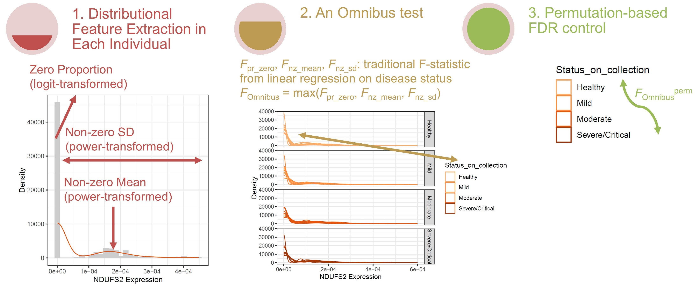

```{r setup, include=FALSE}
library(matrixStats)
library(tidyverse)
library(flextable)
library(kableExtra)
library(ggpubr)
library(clusterProfiler)
library(AnnotationDbi)
library(org.Hs.eg.db)
library(edgeR)
library(ggVennDiagram)
library(gridExtra)
library(cowplot)
library(kableExtra)

file.copy(from = "source_code/DiSC.R", to = "res_to_rev/DiSC.R",
          copy.date = TRUE, overwrite  = TRUE)
file.copy(from = "source_code/DiSC_anal.R", to = "res_to_rev/DiSC_anal.R",
          copy.date = TRUE, overwrite  = TRUE)
file.copy(from = "source_code/DESeq2_anal.R", to = "res_to_rev/DESeq2_anal.R",
          copy.date = TRUE, overwrite  = TRUE)
file.copy(from = "source_code/IDEAS_anal.R", to = "res_to_rev/IDEAS_anal.R",
          copy.date = TRUE, overwrite  = TRUE)
source("res_to_rev/DiSC.R")
summarize_binconf <- function(x, repl){
  # calculate the binomial confidence interval with x successes and repl trials
  # returns a string
  CI_95 <- Hmisc::binconf(x = x, n = repl, method=c("wilson"))
  CI_95 <- round(CI_95*100, digits = 1)
  CI_95 <- paste(CI_95[,"PointEst"]," (", CI_95[,"Lower"], 
                 ", ", CI_95[,"Upper"],")", sep="")
  return(CI_95)
}
```

# Response to reviewer No.1


## What about other power functions? Would there be any power loss for other power functions?


- "supp_info_anal/n12_12_d1.3_c375_vFALSE_0811_b1.RData"
  + This dataset was generated in the "Generate Simulation Datasets" step in the "Parametric_simulation.rmd".
  + It contains 12 cases and 12 controls, each with 375 cell replicates.
  + The read depths of each cell replicate are well-balanced.
  + The dataset comprises a total of 8,000 genes.
  + **Signal density:** 15%, with differences in mean, variance, and mean+variance (each at 5%).

```{r}
load("supp_info_anal/n12_12_d1.3_c375_vFALSE_0811_b1.RData")
dat_list[["meta_ind"]]$phenotype <- as.factor(dat_list[["meta_ind"]]$phenotype)
dat_list[["meta_cell"]]$phenotype <- as.factor(dat_list[["meta_cell"]]$phenotype)
count_matrix <- dat_list$count_matrix
meta_cell <- dat_list$meta_cell
meta_ind <- dat_list$meta_ind
gene_index <- dat_list$gene_index

DiSC_new1 <- function (data.mat, cell.ind, metadata, outcome, covariates = NULL,
                  cell.id = "cell_id", individual.id = "individual", 
                  perm.no = 999, features = c('prev', 'nzm', 'nzsd'), 
                  verbose = TRUE, sequencing.data = TRUE) {
  #same with the original one but added features of 'nzm^0.25' and 'nzsd^0.25'
  
  require(matrixStats)
  
  inds <- unique(cell.ind[[individual.id]])
  #match(target, df$name), order metadata according to inds 
  metadata <- metadata[base::match(inds, metadata[[individual.id]]), ]
  
  cell.list <- list()
  for (ind in inds) {
    cell.list[[ind]] <- cell.ind[cell.ind[[individual.id]] == ind, ][[cell.id]]
  }

  if(sequencing.data){
    depth <- colSums(data.mat)
    data.mat <- t(t(data.mat) / depth)
    log_md_depth <- numeric(length = length(inds))
    names(log_md_depth) <- inds
    for(ind in inds) 
      log_md_depth[ind] <- log(median(depth[cell.list[[ind]]]))
    metadata$log_md_depth <- log_md_depth
  } else {
    depth <- log_md_depth <- NULL
  }
  
  yy.list <- list()
  for (feature in features) {
    yy.list[[feature]] <- matrix(NA, nrow(data.mat), length(inds), 
                                 dimnames = list(rownames(data.mat), inds))
  }
  # feature extraction
  for (ind in inds) {
    expr <- data.mat[, cell.list[[ind]]]
    if('prev' %in% features){
      prv <- rowMeans(expr == 0)
      prv <- log(prv / (1 - prv))
      prv[prv > 7] <- 7 
      prv[prv < -7] <- -7 #prv < 0.001
      yy.list[['prev']][, ind] <- prv 
    }
    if('nzm' %in% features){
      yy.list[['nzm']][, ind] <- sqrt(rowMeans(expr))
    }
    if('nzsd' %in% features){
      yy.list[['nzsd']][, ind] <- 
        sqrt(apply(expr, MARGIN = 1, 
                   FUN = function(x){
                     temp = sd(x[x > 0])
                     if(is.na(temp)) return(0) else
                       return(temp)}
      ))}
    if('sd' %in% features){
      yy.list[['sd']][, ind]   <- sqrt(rowSds(expr)) 
    }
    if('nzm^1' %in% features){
      yy.list[['nzm^1']][, ind] <- rowMeans(expr)
    }
    if('nzsd^1' %in% features){
      yy.list[['nzsd^1']][, ind] <- 
        apply(expr, MARGIN = 1, 
              FUN = function(x){
                temp = sd(x[x > 0])
                if(is.na(temp)) return(0) else
                  return(temp)}
        )
    }
    if('nzm^0.25' %in% features){
      yy.list[['nzm^0.25']][, ind] <- sqrt(sqrt(rowMeans(expr)))
    }
    if('nzsd^0.25' %in% features){
      yy.list[['nzsd^0.25']][, ind] <- 
        sqrt(sqrt(apply(expr, MARGIN = 1, 
                   FUN = function(x){
                     temp = sd(x[x > 0])
                     if(is.na(temp)) return(0) else
                       return(temp)}
      )))}
    # pretty balanced. Some genes have highest Fs in "prev", while others in 
    #"nzm" or "nzsd" 
  }
  
  obj <- basic.func(metadata, yy.list, 
                    grp.name = outcome,
                    adj.name = c(covariates, ifelse(sequencing.data, 
                                                    "log_md_depth", NULL)),
                    stats.combine.func = base::max,
                    perm.no = perm.no, verbose = verbose)
  
  return(obj)
}

set.seed(seed = 123456)
obj0.5 <- DiSC_new1(data.mat = count_matrix,
                   cell.ind = meta_cell,
                   metadata = meta_ind,
                   outcome = "phenotype", covariates = "RIN",
                   cell.id = "cell_id",
                   individual.id = "individual", 
                   perm.no = 999, verbose = FALSE, sequencing.data = TRUE,
                   features = c('prev', 'nzm', 'nzsd')) 
obj1 <- DiSC_new1(data.mat = count_matrix,
                  cell.ind = meta_cell,
                  metadata = meta_ind,
                  outcome = "phenotype", covariates = "RIN",
                  cell.id = "cell_id",
                  individual.id = "individual", 
                  perm.no = 999, verbose = FALSE, sequencing.data = TRUE,
                  features = c('prev', 'nzm^1', 'nzsd^1')) 
obj0.25 <- DiSC_new1(data.mat = count_matrix,
                    cell.ind = meta_cell,
                    metadata = meta_ind,
                    outcome = "phenotype", covariates = "RIN",
                    cell.id = "cell_id",
                    individual.id = "individual", 
                    perm.no = 999, verbose = FALSE, sequencing.data = TRUE,
                    features = c('prev', 'nzm^0.25', 'nzsd^0.25')) 
res_1 <- matrix(0, nrow = 3, ncol = 3, 
                dimnames = list( c("0.25", "0.5", "1"),
                                 c("mean", "var", "mean_var")))
for(rn in rownames(res_1)){
  for(cn in colnames(res_1)){
    code <- str_glue("")
    res_1[rn, cn] <- eval(parse(text = str_glue("mean(obj{rn}$p.adj.fdr[gene_index${cn}_index]<=0.10)")))
  }
}
rownames(res_1) <- str_c("rho = ", rownames(res_1))
colnames(res_1) <- str_replace(str_replace(colnames(res_1), "_", " and "), 
                                     "var", "variance")
res_1 <- apply(res_1*8000*0.05, MARGIN = c(1,2), FUN = summarize_binconf, repl = 8000*0.05)
print(res_1)
kable(res_1)
# flextable(as.data.frame(res_1)) %>%
#   add_header_row(colwidths = c(2, 4),
#                  values = c("Differential expression in")) %>%
#   theme_vanilla()
```

## Null simulation with PBMC data

The authors should consider conducting additional permutations in PBMC analysis to provide a more accurate comparison.

```{r null sim, file = "res_to_rev/response_real_data_null.R", include=TRUE, eval=FALSE, echo=TRUE}

```

```{r null sim result}
thre_raw = 0.05
thre_adj = 0.10
DATE = "1231"
res <- list.files("res_to_rev/response_real_data_null/") %>% 
  # should look like "d@COVIDPBMC-m@DESeq2-v@1231-b@1.rds"
  # "varname@value" and splitted by "-" 
  str_subset(pattern = ".rds$") %>%
  str_remove(pattern = ".rds$") %>%
  sapply(X = ., simplify = FALSE, FUN = \(x){
    temp <- str_split(str_split_1(x, "-"), "@", simplify = TRUE)
    return(c(filname = str_glue("{x}.rds"), 
             setNames(object = temp[,2], nm = temp[,1])))
  }) %>% 
  bind_rows()
res <- res %>% 
  filter(d == "COVIDPBMC" & v == DATE) %>%
  dplyr::rename(Method = "m", Iteration = "b") %>%
  mutate(num_sig_raw = -1, num_sig_adj = -1, num_NA = -1)
for(rr in 1:nrow(res)){
  pval_mat <- readRDS(str_glue("res_to_rev/response_real_data_null/{res$filname[rr]}"))
  if(rr == 1) ngene <- dim(pval_mat)[2]
  res$num_NA[rr] <- sum(is.na(pval_mat["raw", ]))
  res$num_sig_raw[rr] <- sum(pval_mat["raw", ] <= thre_raw, na.rm = TRUE)
  res$num_sig_adj[rr] <- sum(pval_mat["adjusted",] <= thre_adj, na.rm = TRUE)
}
# check if anything wrong (in perm_index)
pval_mat_DESeq2 <- 
  readRDS("res_to_rev/response_real_data_null/d@COVIDPBMC-m@DESeq2-v@1231-b@123.rds")
pval_mat_DiSC   <- 
  readRDS("res_to_rev/response_real_data_null/d@COVIDPBMC-m@DiSC-v@1231-b@123.rds")
pval_mat_IDEAS  <- 
  readRDS("res_to_rev/response_real_data_null/d@COVIDPBMC-m@IDEAS-v@1231-b@123.rds")
stopifnot(cor.test(pval_mat_DESeq2["raw", ], 
                   pval_mat_DiSC["raw",], use = "p")$p.value < 1e-10)
stopifnot(cor.test(pval_mat_DESeq2["raw", ], 
                   pval_mat_IDEAS["raw",], use = "p")$p.value < 1e-10)
# DESeq2: when allowing independentFiltering and cooksCutoff, p-values for some
# genes may be returned as NA. They are assumed to be non-significant genes
res <- res %>%
  mutate(num_NA = if_else(Method == "DESeq2", 0, num_NA)) 
# IDEAS: NA values at 15 genes. For an assessment of FDR and type I error, 
# it should be fine
summary(res$num_NA[res$Method == "IDEAS"])

tbl.temp <- res %>% 
  mutate(prop_sig_raw = num_sig_raw/ngene) %>%
  group_by(Method) %>%
  summarise(.groups = "drop", n_rep = n(), 
            mean_raw = mean(prop_sig_raw), sd_raw = sd(prop_sig_raw),
            "Type I error rate (%)" = str_glue("{round(mean_raw*100,2)} ({round((mean_raw-1.96*sd_raw/sqrt(n_rep))*100,2)}, {round((mean_raw+1.96*sd_raw/sqrt(n_rep))*100,2)})"),
            n_sig_adj = sum(num_sig_adj > 0),
            "False discovery rate (%)" = summarize_binconf(x = n_sig_adj, repl = n_rep),
            mean_adj = mean(num_sig_adj), sd_adj = sd(num_sig_adj),
            "Average number of false positive fundings" = str_glue("{round(mean_adj,1)} ({round(mean_adj-1.96*sd_adj/sqrt(n_rep),1)}, {round(mean_adj+1.96*sd_adj/sqrt(n_rep),1)})")
            ) %>%
  dplyr::select(all_of(c("Method", "Type I error rate (%)", 
                  "False discovery rate (%)", 
                  "Average number of false positive fundings"))) %>%
  arrange(match(Method, c("DiSC", "IDEAS", "DESeq2"))) %>%
  kbl() %>%
  kable_classic(full_width = F, html_font = "Cambria")
tbl.temp

# save_kable(tbl.temp, file = "results/real_null_fdr2.jpeg", 
#            density = 1000, zoom = 2.5)
```

## Computational time

In section 3.3, to showcase the computational efficiency of DiSC, the authors adopted a single cell data consisting of 24 individuals and 9,000 cells. This was not actually a large size dataset since there were a lot of scRNA-seq analysis of population-scale involved cells up to millions. Also, in this experiment, DiSC improved a few seconds compared to DESeq2 which was not particularly convincing. Furthermore, the authors may need to perform multiple rounds of analysis and report the averaged computational time here instead of the results from a single round.

```{r comp time, file = "res_to_rev/response_comp_time_part2.R", eval = FALSE}

```


```{r comp time result}
readLines('res_to_rev/response_comp_time/response_comp_time_part2.out', warn = FALSE) %>%
  str_subset(pattern = "(Model name:|CPU MHz:)") %>%
  cat(sep = '\n')

# for increased sample sizes, number of genes and number of cells
comp_time <- readRDS("res_to_rev/response_comp_time/time_results_0107.rds")
levels(comp_time$expr) <- str_remove(levels(comp_time$expr), "_anal.*$")
comp_time <- comp_time %>% # nsample in these data are for one single arm
  dplyr::rename("Method" = "expr") %>%
  mutate(Method = fct_relevel(Method, "DiSC","IDEAS","DESeq2", "BSDE","iDESC"),
         "Time (s)" = time / 1e9)

options(scipen = 3)
N_gene <- which.max(tabulate(comp_time$ngene)) # the most used level
N_cell <- which.max(tabulate(comp_time$ncell))
N_sample <- which.max(tabulate(comp_time$nsample))
# temp <- comp_time %>%
#   mutate(sample_fig = (ngene == N_gene & ncell == N_cell),
#          gene_fig = (nsample == N_sample & ncell == N_cell),
#          cell_fig = (nsample == N_sample & ngene == N_gene))
# bind_rows(
#   mutate(filter(temp, sample_fig), y = nsample),
#   mutate(filter(temp, gene_fig), y = ngene),
#   mutate(filter(temp, cell_fig), y = ncell)
# )
fig1 <- comp_time %>% 
  filter(ngene == N_gene, ncell == N_cell) %>%
  ggplot(aes(x = nsample*2, y= `Time (s)`, color = `Method`)) + # nsample *2 for two arms 
  geom_point(size=0.3) + 
  geom_smooth(method = "lm", formula = y ~ x, se = FALSE, linewidth = 0.3) +
  xlab("Sample Sizes") + ylab("Time / s") + 
  scale_y_log10(limits = c(0.1, 10000)) +
  scale_color_brewer(palette = "Set1", name = "Method") +
  annotate("text", x=20, y=8000,
           label= str_glue("# of genes: {N_gene},\n# of cells: {N_cell}"))+
  theme_bw()
fig2 <- comp_time %>% 
  filter(nsample == N_sample, ncell == N_cell) %>%
  ggplot(aes(x = ngene, y= `Time (s)`, color = `Method`)) + 
  geom_point(size=0.3) + 
  geom_smooth(method = "lm", formula = y ~ x, se = FALSE, linewidth = 0.3) +
  xlab("Number of Genes") + ylab("Time / s") + 
  scale_y_log10(limits = c(0.1, 10000)) +
  scale_color_brewer(palette = "Set1", name = "Method") +
  annotate("text", x=200, y=8000,
           label= str_glue("# of individuals: {N_sample*2},\n# of cells: {N_cell}"))+
  theme_bw()
fig3 <- comp_time %>% 
  filter(nsample == N_sample, ngene == N_gene) %>%
  ggplot(aes(x = ncell, y= `Time (s)`, color = `Method`)) + 
  geom_point(size=0.3) + 
  geom_smooth(method = "lm", formula = y ~ x, se = FALSE, linewidth = 0.3) +
  xlab("Number of Cells") + ylab("Time / s") + 
  scale_y_log10(limits = c(0.1, 10000)) +
  scale_color_brewer(palette = "Set1", name = "Method") +
  annotate("text", x=200, y=8000,
           label= str_glue("# of individuals: {N_sample*2},\n# of genes: {N_gene}"))+
  theme_bw()

time_fig <- 
  ggarrange(fig1, fig2, fig3, ncol = 3,  
            legend = "bottom", common.legend = TRUE)

time_fig

# for typical datasets
comp_time_ng2000_nc375_ns24 <-
  readRDS("res_to_rev/response_comp_time/time_results_ng2000_nc375_ns24_0107.rds")
comp_time_ng2000_nc375_ns24$ngene = 2000
comp_time_ng2000_nc375_ns24$ncell = 375
comp_time_ng2000_nc375_ns24$nsample = 24 # do not need to x2 here
comp_time_ng8000_nc1000_ns100 <-
  readRDS("res_to_rev/response_comp_time/time_results_ng8000_nc1000_ns400_0107.rds")
comp_time_ng8000_nc1000_ns100$ngene = 8000
comp_time_ng8000_nc1000_ns100$ncell = 1000
comp_time_ng8000_nc1000_ns100$nsample = 400
comp_time_typical <- bind_rows(comp_time_ng2000_nc375_ns24,  
                               comp_time_ng8000_nc1000_ns100)
temp <- levels(comp_time_typical$expr)
temp[str_detect(temp, "^DiSC") & 
       str_detect(temp, "perm.no = 99\\)$")] <- "DiSC_99"
temp[str_detect(temp, "^DiSC") & 
       str_detect(temp, "perm.no = 999\\)$")] <- "DiSC"
temp <- str_remove(temp, "_anal.*$")
levels(comp_time_typical$expr) <- temp
time_tab <- comp_time_typical %>%
  filter(expr != "DiSC_99") %>%
  bind_rows(data.frame(expr = c("IDEAS", "iDESC", "BSDE"), time = NA, 
                       ngene = 8000, ncell = 1000, nsample = 400),
            data.frame(expr = c("iDESC", "BSDE"), time = NA, 
                       ngene = 2000, ncell = 375, nsample = 24)
            ) %>%
  mutate(Time = time/1e9) %>%
  mutate(`Dataset` = 
           str_c(nsample, " individuals, ",
                 ncell, " cells each, ",
                 ngene, " genes sequenced")) %>%
  dplyr::rename("Method" = "expr") %>%
  group_by(Method, `Dataset`) %>%
  summarise(.groups = "drop", 
            `Computational Time /s` = 
              str_c(round(mean(Time),1), "±", round(sd(Time),1), sep = " ")) %>%
  replace_na(list(`Computational Time /s` = "> 1800")) %>%
  arrange(`Dataset`, 
          match(Method, c("DiSC","IDEAS","DESeq2","BSDE","iDESC"))) %>%
  pivot_wider(id_cols = `Dataset`, names_from = Method, 
              values_from = `Computational Time /s`) %>%
  ggtexttable(., rows = NULL, theme = ttheme("blank"))%>%
  tbody_add_border() %>% thead_add_border() %>%
  tab_add_title(text = "Computation Time (in Seconds) for Different Differential Expression Analysis Methods", face = "bold")

time_tab

time_figure_combined <- 
  ggarrange(time_fig, time_tab, labels = c("(a)", "(b)"),
            ncol = 1, nrow = 2, heights = c(1, 0.3),
            font.label = list(size = 12, color = "black", 
                              face = "plain", family = NULL))
time_figure_combined
ggsave(filename = "results/comp_time_rev.jpeg", time_figure_combined, 
       width = 9, height = 6)
ggsave(filename = "results/comp_time_rev.pdf" , time_figure_combined,
       width = 9, height = 6)
```

## GO enrichment analysis on those DiSC-specific DE genes

```{r GO}
firstup <- function(x) {
  # uppercase the first letter in GO descriptions
  substr(x, 1, 1) <- toupper(substr(x, 1, 1))
  x
}
pval_thre = 0.10 # the FDR threshold
competing_methods = c("DiSC", "IDEAS", "DESeq2")
#list the results and convert them to a dataframe
res <- list.files("real_data_anal/res/") %>% 
  # should look like "d@COVIDPBMC-m@DESeq2-v@0612-c@B_cell.rds"
  # "varname@value" and splitted by "-" 
  str_subset(pattern = ".rds$") %>%
  str_remove(pattern = ".rds$") %>%
  sapply(X = ., simplify = FALSE, FUN = \(x){
    temp <- str_split(str_split_1(x, "-"), "@", simplify = TRUE)
    return(c(filname = str_glue("{x}.rds"), 
             setNames(object = temp[,2], nm = temp[,1])))
  }) %>% 
  bind_rows()
res <- res %>% 
  filter(d == "COVIDPBMC" & v == "0612") %>%
  dplyr::rename(Method = "m", Cell_Type = "c")
num_sig <- numeric(nrow(res))
name_sig <- character(nrow(res))
for(rr in 1:nrow(res)){
  pval_mat <- readRDS(str_glue("real_data_anal/res/{res$filname[rr]}"))
  sig_genes <- colnames(pval_mat)[pval_mat["adjusted", ] <= pval_thre]
  sig_genes <- sig_genes[!is.na(sig_genes)] # some values can be NAs in DESeq2
  name_sig[rr] <- str_c(sig_genes, collapse = "::")
  num_sig[rr] <- length(sig_genes)
  rm(pval_mat)
}
res <- res %>%
  mutate(num_sig = num_sig, name_sig = name_sig) %>%
  mutate(Method = factor(Method, levels = competing_methods)) %>%
  mutate(Cell_Type = factor(Cell_Type)) %>%
  # order the cell types according to the how many significant genes DiSC found
  mutate(Cell_Type = fct_reorder2(.f = Cell_Type, .x = Method, .y = num_sig, 
                                  .desc = FALSE,
                                  .fun = \(.x, .y) return(.y[.x == "DiSC"])))

deg_CD4 <- res %>% 
  filter(Cell_Type == "CD4", Method == "DiSC") %>%
  pull(name_sig) %>%
  str_split_1(pattern = "::")
deg_CD4_other_methods <- res %>% 
  filter(Cell_Type == "CD4", Method != "DiSC") %>%
  pull(name_sig) %>% 
  str_c(collapse = "::") %>%
  str_split_1(pattern = "::") %>% 
  unique()
deg_CD4_DiSC_only <- setdiff(deg_CD4, deg_CD4_other_methods)
cat(str_glue("Number of DEGs identified by DiSC: {length(deg_CD4)}. Number of DEGs identified by DiSC only but not DESeq2 oe IDEAS: {length(deg_CD4_DiSC_only)}\n\n"))
go_enrichment_CD4_BP <- enrichGO(gene = deg_CD4_DiSC_only, OrgDb = "org.Hs.eg.db", 
                                 keyType = "SYMBOL", ont = "BP")
go_enrichment_CD4_BP <- go_enrichment_CD4_BP %>% 
  as_tibble() %>% 
  mutate(ratio = sapply(GeneRatio, function(txt) eval(parse(text=txt)), 
                        simplify = TRUE)) %>%
  mutate(`-log_p` = -log10(p.adjust))
go_enrichment_CD4_BP_10 <-  go_enrichment_CD4_BP %>%
  slice_max(order_by = `-log_p`, n = 10) %>%
  mutate(Description = firstup(Description)) %>%
  mutate(Description = stringr::str_wrap(Description, width = 40))

deg_CD8 <- res %>% 
  filter(Cell_Type == "CD8", Method == "DiSC") %>%
  pull(name_sig) %>%
  str_split_1(pattern = "::")
deg_CD8_other_methods <- res %>% 
  filter(Cell_Type == "CD8", Method != "DiSC") %>%
  pull(name_sig) %>% 
  str_c(collapse = "::") %>%
  str_split_1(pattern = "::") %>% 
  unique()
deg_CD8_DiSC_only <- setdiff(deg_CD8, deg_CD8_other_methods)
cat(str_glue("Number of DEGs identified by DiSC: {length(deg_CD8)}. Number of DEGs identified by DiSC only but not DESeq2 oe IDEAS: {length(deg_CD8_DiSC_only)}\n\n"))
go_enrichment_CD8_BP <- enrichGO(gene = deg_CD8_DiSC_only, OrgDb = "org.Hs.eg.db", 
                                 keyType = "SYMBOL", ont = "BP")
go_enrichment_CD8_BP <- go_enrichment_CD8_BP %>% 
  as_tibble() %>% 
  mutate(ratio = sapply(GeneRatio, function(txt) eval(parse(text=txt)), 
                        simplify = TRUE)) %>%
  mutate(`-log_p` = -log10(p.adjust))
go_enrichment_CD8_BP_10 <-  go_enrichment_CD8_BP %>%
  slice_max(order_by = `-log_p`, n = 10) %>%
  mutate(Description = firstup(Description)) %>%
  mutate(Description = stringr::str_wrap(Description, width = 40))

log_p_comb <- c(go_enrichment_CD4_BP_10$`-log_p`, 
                go_enrichment_CD8_BP_10$`-log_p`)
go_breaks <- seq(from = floor(min(log_p_comb)), to = ceiling(max(log_p_comb)),
                 length.out = 5)
figure_GO_CD4 <- go_enrichment_CD4_BP_10 %>%
  mutate(Description = fct_reorder(Description, `-log_p`, .desc = TRUE)) %>%
  ggplot(aes(x = Description, y = ratio, fill = `-log_p`)) +
  geom_bar(stat = "identity")+
  geom_text(label = go_enrichment_CD4_BP_10$GeneRatio, vjust=-1, size = 2)+
  scale_y_continuous(labels = scales::percent, limits = c(0, 0.11)) + 
  scale_fill_steps(name = "-log10(Adj P)", breaks = go_breaks, 
                   limits = c(min(go_breaks), max(go_breaks)),
                   low = "#bdd7e7", high = "#2171b5")+
  theme_bw()+labs(x = NULL, y = "% of DE Genes Detected")+
  theme(axis.text.x = element_text(angle = 90, vjust = 0.5, hjust=1))+
  annotate("text", x = 9, y= 0.10, label = "CD4") 
figure_GO_CD8 <- go_enrichment_CD8_BP_10 %>%
  mutate(Description = fct_reorder(Description, `-log_p`, .desc = TRUE)) %>%
  ggplot(aes(x = Description, y = ratio, fill = `-log_p`)) +
  geom_bar(stat = "identity")+
  geom_text(label = go_enrichment_CD8_BP_10$GeneRatio, vjust=-1, size = 2)+
  scale_y_continuous(labels = scales::percent, limits = c(0, 0.11)) + 
  scale_fill_steps(name = "-log10(Adj P)", breaks = go_breaks, 
                   limits = c(min(go_breaks), max(go_breaks)),
                   low = "#bdd7e7", high = "#2171b5")+
  theme_bw()+labs(x = NULL, y = "% of DE Genes Detected")+
  theme(axis.text.x = element_text(angle = 90, vjust = 0.5, hjust=1))+
  annotate("text", x = 9, y= 0.10, label = "CD8") 
figure_GO_CD4
figure_GO_CD8

GO_fig <- 
  ggarrange(figure_GO_CD4, figure_GO_CD8, ncol = 2,  
            legend = "right", common.legend = TRUE)
GO_fig
ggsave(filename = "res_to_rev/GO_DiSC_only.jpeg", GO_fig,
       width = 8, height = 5)
```

# Response to reviewer No.2

## More recent methods such as iDESC and BSDE should also be included in the comparisons

```{r, file= "res_to_rev/response_more_methods.R", eval=FALSE, echo=TRUE}
```

```{r}
thre_raw = 0.05
thre_adj = 0.10
res <- list.files("res_to_rev/response_more_methods/") %>% 
  # should look like "results_BSDE_n12_12_d1.3_c375_vFALSE_0811_b1.RData"
  # but there is a typo that they are actually .rds file
  # need to rename all the files into .rds before running the code
  str_subset(pattern = ".rds$")
res <- res %>%
  str_remove(pattern = ".rds$") %>%
  str_split("_", simplify = TRUE) %>%
  cbind(res) %>%
  magrittr::set_colnames(c("Results", "Method", "N_Cas", "N_Ctr", "Effect_Size", 
                           "N_Cell", "Var_Cell", "Version", "Iteration", "Filename")) %>%
  as_tibble() %>%
  mutate(N_Cas = as.numeric(str_remove(N_Cas, "n")), 
         N_Ctr = as.numeric(N_Ctr),
         N_tot = N_Cas + N_Ctr,
         Effect_Size = as.numeric(str_remove(Effect_Size, "d")),
         N_Cell = as.numeric(str_remove(N_Cell, "c")),
         Var_Cell = as.logical(str_remove(Var_Cell, "v")),
         Iteration = as.numeric(str_remove(Iteration, "b"))) %>%
  filter(Results == "results") %>%
  mutate(num_NA = -1, 
         num_sig_mean_raw = -1, num_sig_var_raw = -1, num_sig_mv_raw = -1,num_sig_ee_raw = -1, 
         num_sig_mean_adj = -1, num_sig_var_adj = -1, num_sig_mv_adj = -1,num_sig_ee_adj = -1)
gene_index <- readRDS(str_glue("res_to_rev/response_more_methods/geneidx_null_n12_12_d1.3_c375_vFALSE_0811_b1.rds"))

for(rr in 1:nrow(res)){
  pval_mat <- readRDS(str_glue("res_to_rev/response_more_methods/{res$Filename[rr]}"))
  if(rr == 1) ngene <- dim(pval_mat)[2]
  
  pval_raw <- pval_mat["raw", ]
  res$num_NA[rr] <- sum(is.na(pval_raw))
  
  res$num_sig_mean_raw[rr] <- sum(pval_raw[gene_index$mean_index] <= thre_raw, na.rm = TRUE)
  res$num_sig_var_raw[rr]  <- sum(pval_raw[gene_index$var_index]  <= thre_raw, na.rm = TRUE)
  res$num_sig_mv_raw[rr]   <- sum(pval_raw[gene_index$mean_var_index] <= thre_raw, na.rm = TRUE)
  res$num_sig_ee_raw[rr]   <- sum(pval_raw[gene_index$EE_index]   <= thre_raw, na.rm = TRUE)
  
  if(res$Method[rr] %in% c("BSDE", "IDEAS", "iDESC")){
    pi0 = 2*sum(pval_raw > 0.5, na.rm = TRUE)/sum(!is.na(pval_raw))
    # really need this pi0, otherwise in some cases, error will occur
    pi0 = ifelse(pi0>1, 1, ifelse(pi0<0.5, 0.5, pi0)) # 0.5<=pi0<=1
    pval_adj <- qvalue::qvalue(pval_raw, pi0=pi0)$qvalues
  } else if(res$Method[rr] %in% c("DiSC", "DESeq2")){
    pval_adj <- pval_mat["adjusted",]
  }
  
  res$num_sig_mean_adj[rr] <- sum(pval_adj[gene_index$mean_index] <= thre_adj, na.rm = TRUE)
  res$num_sig_var_adj[rr]  <- sum(pval_adj[gene_index$var_index]  <= thre_adj, na.rm = TRUE)
  res$num_sig_mv_adj[rr]   <- sum(pval_adj[gene_index$mean_var_index] <= thre_adj, na.rm = TRUE)
  res$num_sig_ee_adj[rr]   <- sum(pval_adj[gene_index$EE_index]   <= thre_adj, na.rm = TRUE)
}
# DESeq2: when allowing independentFiltering and cooksCutoff, p-values for some
# genes may be returned as NA. They are assumed to be non-significant genes
# IDEAS: NA values at 1 or 2 genes. For an assessment of FDR and type I error, 
# it should be fine
# iDESC: convergence issues occur in 7-10% of genes and returned NA values
# Model convergence problem; non-positive-definite Hessian matrix; NA values for likelihood/AIC/etc.
# false convergence
res %>% 
  tableone::CreateCatTable(vars = c("num_NA"), strata = "Method",
                           data = ., test = FALSE)
summarise_CI95 <- function(x, percentage = TRUE, digits = 2){
  x <- x[!is.na(x)]
  nx <- length(x)
  center <- mean(x)
  se <- sd(x)/sqrt(nx)
  upper <- center + 1.96*se
  lower <- center - 1.96*se
  if(percentage)
    return(str_glue("{round(center*100, digits)} ({round(lower*100, digits)}, {round(upper*100, digits)})")) else
      return(str_glue("{round(center, digits)} ({round(lower, digits)}, {round(upper, digits)})"))
}
tbl.temp <- res %>% 
  dplyr::select(Method, Iteration, starts_with("num")) %>%
  mutate(pr_sig_mean_raw = num_sig_mean_raw/length(gene_index$mean_index),
         pr_sig_var_raw  = num_sig_var_raw /length(gene_index$var_index),
         pr_sig_mv_raw   = num_sig_mv_raw  /length(gene_index$mean_var_index),
         pr_sig_ee_raw   = num_sig_ee_raw  /length(gene_index$EE_index), # type I error
         
         pr_sig_mean_adj = num_sig_mean_adj/length(gene_index$mean_index), # power
         pr_sig_var_adj  = num_sig_var_adj /length(gene_index$var_index), # power
         pr_sig_mv_adj   = num_sig_mv_adj  /length(gene_index$mean_var_index), # power
         fdr = num_sig_ee_adj/
           (num_sig_mean_adj+num_sig_var_adj+num_sig_mv_adj+num_sig_ee_adj),
         ) %>%
  group_by(Method) %>%
  summarise(.groups = "drop", 
            "False Discovery Proportions (%)" = summarise_CI95(fdr, digits = 1),
            "Positive Findings (%), DE in Mean" = summarise_CI95(pr_sig_mean_adj, digits = 1),
            "Positive Findings (%), DE in Var" = summarise_CI95(pr_sig_var_adj, digits = 1),
            "Positive Findings (%), DE in Both Mean and Var" = summarise_CI95(pr_sig_mv_raw, digits = 1)
            ) %>%
  dplyr::select(Method, contains("%")) %>%
  arrange(match(Method, c("DiSC", "IDEAS", "DESeq2", "BSDE", "iDESC"))) %>%
  kbl() %>%
  kable_classic(full_width = F, html_font = "Cambria")
tbl.temp

# from parametric simulation

EE1.2 <- readRDS("res_to_rev/EE1.2.rds")
DE1.2 <- readRDS("res_to_rev/DE1.2.rds")
EE2.2 <- readRDS("res_to_rev/EE2.2.rds")
DE2.2 <- readRDS("res_to_rev/DE2.2.rds")
EE3.2 <- readRDS("res_to_rev/EE3.2.rds")
DE3.2 <- readRDS("res_to_rev/DE3.2.rds")

figure_para_sim <-
  ggarrange(EE1.2, DE1.2, EE3.2, DE3.2, EE2.2, DE2.2, 
            widths = c(1,3), ncol = 2, nrow = 3,
            legend = "bottom", common.legend = TRUE,
            labels = c("(a)", NA, "(b)", NA, "(c)", NA),
            font.label = list(size = 12, color = "black", 
                              face = "plain", family = NULL))
ggsave(filename = "results/para_sim_rev.jpeg", figure_para_sim, 
       width = 8, height = 9)
ggsave(filename = "results/para_sim_rev.jpeg" , figure_para_sim,
       width = 8, height = 9)

```

## More real data analyses

The Alzheimer’s disease (SEA-AD) dataset was originally obtained by Gabitto et al. (2024) to gain a deep molecular and cellular understanding of the early pathogenesis of Alzheimer’s disease using single-nuclei multi-omics method.

The snRNA-seq (single nuclei RNA sequencing) data matrix and metadata can be retrieved from https://cellxgene.cziscience.com/collections/1ca90a2d-2943-483d-b678-b809bf464c30.


```{r, file= "res_to_rev/response_real_data_anal_part1.R", eval=FALSE, echo=TRUE}

```

```{r, file= "res_to_rev/response_real_data_anal_part2.R", eval=FALSE, echo=TRUE}

```

```{r}
DATE = "0119"
pval_thre = 0.10
competing_methods = c("DiSC", "IDEAS", "DESeq2")
#list the results and convert them to a dataframe
res <- list.files("res_to_rev/response_real_data_anal") %>% 
  # should look like "d@COVIDPBMC-m@DESeq2-v@0612-c@B_cell.rds"
  # "varname@value" and splitted by "-" 
  str_subset(pattern = ".rds$") %>%
  str_remove(pattern = ".rds$") %>%
  sapply(X = ., simplify = FALSE, FUN = \(x){
    temp <- str_split(str_split_1(x, "-"), "@", simplify = TRUE)
    return(c(filname = str_glue("{x}.rds"), 
             setNames(object = temp[,2], nm = temp[,1])))
  }) %>% 
  bind_rows()

res <- res %>% 
  filter(d == "AD" & v == DATE) %>%
  dplyr::rename(Method = "m", Cell_Type = "c")
num_sig <- numeric(nrow(res))
name_sig <- character(nrow(res))
for(rr in 1:nrow(res)){
  pval_mat <- readRDS(str_glue("res_to_rev/response_real_data_anal/{res$filname[rr]}"))
  sig_genes <- colnames(pval_mat)[pval_mat["adjusted", ] <= pval_thre]
  sig_genes <- sig_genes[!is.na(sig_genes)] # some values can be NAs in DESeq2
  name_sig[rr] <- str_c(sig_genes, collapse = "::")
  num_sig[rr] <- length(sig_genes)
  rm(pval_mat)
}
res <- res %>%
  mutate(num_sig = num_sig, name_sig = name_sig) %>%
  mutate(Method = factor(Method, levels = competing_methods)) %>%
  mutate(Cell_Type = factor(Cell_Type)) %>%
  # order the cell types according to the how many significant genes DiSC found
  mutate(Cell_Type = fct_reorder2(.f = Cell_Type, .x = Method, .y = num_sig, 
                                  .desc = FALSE,
                                  .fun = \(.x, .y) return(.y[.x == "DiSC"])))

more_than_IDEAS <- res %>%
  group_by(Cell_Type) %>%
  summarise(more_than_IDEAS = num_sig[Method == "DiSC"] - 
              num_sig[Method == "IDEAS"]) %>%
  arrange(desc(more_than_IDEAS))
print(more_than_IDEAS, n=30)
wilcox.test(more_than_IDEAS$more_than_IDEAS)

# Number of positive findings in the SEA-AD dataset
res %>% dplyr::select(Method, Cell_Type, num_sig) %>%
  arrange(desc(Cell_Type), Method) %>% # order a factor
  pivot_wider(names_from = Cell_Type, values_from = num_sig) %>%
  kbl(digits = 4, 
      caption = "Number of Positive Findings in COVID-PBMC dataset(Adjusted for FDR)") %>% 
  kable_classic(full_width = F, html_font = "Cambria")

figure1 <- res %>% 
  ggplot(., aes(x=Cell_Type, color=Method, fill=Method, y=num_sig)) +
  geom_bar(stat = "identity", 
           position = position_dodge2(padding = 0.6, reverse = TRUE), 
           width=0.7) + 
  scale_y_sqrt()+
  xlab("Cell Types") + 
  ylab("Number of DE Genes Detected")+
  theme_bw() + coord_flip() + 
  scale_color_brewer(palette = "Set1") + 
  scale_fill_brewer(palette = "Set1") +
  theme(legend.position='right') 

# Overlaps in positive findings of AS and Oligodendrocyte between methods
Venn_break <- res %>% filter(Cell_Type %in% c("Astrocyte", "Oligodendrocyte"))
Venn_break
Venn_break <- seq(from = 0, to = 500, length.out = 5)
# cell_to_disp <- res %>% 
#   group_by(Cell_Type) %>% 
#   summarise(median_across_method = median(num_sig)) %>%
#   filter(median_across_method == max(median_across_method)) %>% 
#   pull(Cell_Type) %>% as.character()
Venn_AS <- res %>% 
  filter(Cell_Type == "Astrocyte") %>%
  mutate(name_sig2 = str_split(name_sig, "::", simplify = FALSE)) %>%
  mutate(name_sig2 = magrittr::set_names(x = name_sig2, value = Method)) %>%
  pull(name_sig2)
Venn_AS <- Venn_AS[base::match(competing_methods, names(Venn_AS))] #df[match(target, df$name),]
figure2 <- ggVennDiagram(Venn_AS, label = c("count"), 
                         set_color = RColorBrewer::brewer.pal(3, "Set1")) + 
  scale_fill_steps(high = "grey60", low = "grey100", breaks = Venn_break, 
                   limits = c(min(Venn_break), max(Venn_break)),name = "Counts") +
  scale_x_continuous(expand = expansion(mult = .2))+
  theme(legend.position='bottom')
Venn_OL <- res %>% 
  filter(Cell_Type == "Oligodendrocyte") %>%
  mutate(name_sig2 = str_split(name_sig, "::", simplify = FALSE)) %>%
  mutate(name_sig2 = magrittr::set_names(x = name_sig2, value = Method)) %>%
  pull(name_sig2)
Venn_OL <- 
  Venn_OL[base::match(competing_methods, names(Venn_OL))] #df[match(target, df$name),]
figure3 <- ggVennDiagram(Venn_OL, label = c("count"),
                         set_color = RColorBrewer::brewer.pal(3, "Set1")) + 
  scale_fill_steps(high = "grey60", low = "grey100", breaks = Venn_break, 
                   limits = c(min(Venn_break), max(Venn_break)),name = "Counts") +
  scale_x_continuous(expand = expansion(mult = .2))+
  theme(legend.position='bottom')
#the two figures will have the same legend as specified in 
#breaks = Venn_break and limits = c(min(Venn_break), max(Venn_break))
#but it is still good to check this before align the plots
figure2
figure3
figure2_3 <- lemon::grid_arrange_shared_legend(figure2, figure3, 
                                               nrow = 1, position = "right") %>%
  as_ggplot()


# GO enrichment analysis 
firstup <- function(x) {
  # uppercase the first letter in GO descriptions
  substr(x, 1, 1) <- toupper(substr(x, 1, 1))
  x
}
deg_AS <- res %>% 
  filter(Cell_Type == "Astrocyte", Method == "DiSC") %>%
  pull(name_sig) %>%
  str_split_1(pattern = "::")
deg_AS_other_methods <- res %>% 
  filter(Cell_Type == "Astrocyte", Method != "DiSC") %>%
  pull(name_sig) %>% 
  str_c(collapse = "::") %>%
  str_split_1(pattern = "::") %>% 
  unique()
go_enrichment_AS_BP <- enrichGO(gene = deg_AS, OrgDb = "org.Hs.eg.db", 
                                 keyType = "ENSEMBL", ont = "BP") 
go_enrichment_AS_BP <- go_enrichment_AS_BP %>% 
  as_tibble() %>% 
  mutate(Count_overlap = sapply(X = geneID,
                                FUN = \(x, g_vec){
                                  x = str_split_1(x, pattern = "/")
                                  return(sum(x %in% g_vec))},
                                simplify = TRUE, USE.NAMES =FALSE,
                                g_vec = deg_AS_other_methods),
         Count_DiSC = Count - Count_overlap) %>%
  mutate(ratio = sapply(GeneRatio, function(txt) eval(parse(text=txt)), 
                        simplify = TRUE)) %>%
  mutate(`-log_p` = -log10(p.adjust))
go_enrichment_AS_BP_10 <-  go_enrichment_AS_BP %>%
  slice_max(order_by = `-log_p`, n = 10) %>%
  mutate(Description = firstup(Description)) %>%
  mutate(Description = stringr::str_wrap(Description, width = 40))

deg_OL <- res %>% 
  filter(Cell_Type == "Oligodendrocyte", Method == "DiSC") %>%
  pull(name_sig) %>%
  str_split_1(pattern = "::")
deg_OL_other_methods <- res %>% 
  filter(Cell_Type == "Oligodendrocyte", Method != "DiSC") %>%
  pull(name_sig) %>% 
  str_c(collapse = "::") %>%
  str_split_1(pattern = "::") %>% 
  unique()
go_enrichment_OL_BP <- enrichGO(gene = deg_OL, OrgDb = "org.Hs.eg.db", 
                                 keyType = "ENSEMBL", ont = "BP") 
go_enrichment_OL_BP <- go_enrichment_OL_BP %>% 
  as_tibble() %>% 
  mutate(Count_overlap = sapply(X = geneID,
                                FUN = \(x, g_vec){
                                  x = str_split_1(x, pattern = "/")
                                  return(sum(x %in% g_vec))},
                                simplify = TRUE, USE.NAMES =FALSE,
                                g_vec = deg_OL_other_methods),
         Count_DiSC = Count - Count_overlap) %>%
  mutate(ratio = sapply(GeneRatio, function(txt) eval(parse(text=txt)), 
                        simplify = TRUE)) %>%
  mutate(`-log_p` = -log10(p.adjust))
go_enrichment_OL_BP_10 <-  go_enrichment_OL_BP %>%
  slice_max(order_by = `-log_p`, n = 10) %>%
  mutate(Description = firstup(Description)) %>%
  mutate(Description = stringr::str_wrap(Description, width = 40))

log_p_comb <- c(go_enrichment_AS_BP_10$`-log_p`, 
                go_enrichment_OL_BP_10$`-log_p`)
go_breaks <- seq(from = floor(min(log_p_comb)), to = ceiling(max(log_p_comb)),
                 length.out = 5)
figure4 <- go_enrichment_AS_BP_10 %>%
  mutate(Description = fct_reorder(Description, `-log_p`, .desc = TRUE)) %>%
  ggplot(aes(x = Description, y = ratio, fill = `-log_p`)) +
  geom_bar(stat = "identity")+
  geom_text(label = go_enrichment_AS_BP_10$GeneRatio, vjust=-1, size = 2)+
  scale_y_continuous(labels = scales::percent, limits = c(0, 0.075)) + 
  scale_fill_steps(name = "-log10(Adj P)", breaks = go_breaks, 
                   limits = c(min(go_breaks), max(go_breaks)),
                   low = "#bdd7e7", high = "#2171b5")+
  theme_bw()+labs(x = NULL, y = "% of DE Genes Detected")+
  theme(axis.text.x = element_text(angle = 90, vjust = 0.5, hjust=1))
figure4
figure5 <- go_enrichment_OL_BP_10 %>%
  mutate(Description = fct_reorder(Description, `-log_p`, .desc = TRUE)) %>%
  ggplot(aes(x = Description, y = ratio, fill = `-log_p`)) +
  geom_bar(stat = "identity")+
  geom_text(label = go_enrichment_OL_BP_10$GeneRatio, vjust=-1, size = 2)+
  scale_y_continuous(labels = scales::percent, limits = c(0, 0.075)) + 
  scale_fill_steps(name = "-log10(Adj P)", breaks = go_breaks, 
                   limits = c(min(go_breaks), max(go_breaks)),
                   low = "#bdd7e7", high = "#2171b5")+
  theme_bw()+labs(x = NULL, y = "% of DE Genes Detected")+
  theme(axis.text.x = element_text(angle = 90, vjust = 0.5, hjust=1))
figure5
figure4_5 <- lemon::grid_arrange_shared_legend(figure4, figure5, 
                                               position = "right")%>%
  as_ggplot()

figures <- 
  arrangeGrob(figure1,                              
              figure2_3,
              figure4_5, 
              layout_matrix = rbind(c(1,1), c(2,2), c(3,3), c(3, 3))) %>%
  as_ggplot() + 
  draw_plot_label(label = c("(a)", "(b) AS", "(c) OL", "(d)", "(e)"), 
                  x = c(0, -0.025, 0.42, 0, 0.45), 
                  y = c(1, 0.75, 0.75, 0.5, 0.5),
                  size = 14, color = "black", 
                  fontface = "plain", family = NULL)
figures
ggsave(filename = "results/AD_anal_rev.pdf" , figures,
       width = 8, height = 10)
ggsave(filename = "results/AD_anal_rev.jpeg" , figures,
       width = 8, height = 10)
```

```{r, fig.width=8, fig.height=6}
# GO enrichment analysis 
firstup <- function(x) {
  # uppercase the first letter in GO descriptions
  substr(x, 1, 1) <- toupper(substr(x, 1, 1))
  x
}

deg_AS <- res %>% 
  filter(Cell_Type == "Astrocyte", Method == "DiSC") %>%
  pull(name_sig) %>%
  str_split_1(pattern = "::")
deg_AS_DESeq2 <- res %>% 
  filter(Cell_Type == "Astrocyte", Method == "DESeq2") %>%
  pull(name_sig) %>%
  str_split_1(pattern = "::")
length(deg_AS_DESeq2)
length(setdiff(deg_AS_DESeq2, deg_AS))

go_enrichment_AS_BP <- enrichGO(gene = setdiff(deg_AS_DESeq2, deg_AS), 
                                OrgDb = "org.Hs.eg.db", 
                                keyType = "ENSEMBL", ont = "BP") 
go_enrichment_AS_BP <- go_enrichment_AS_BP %>% 
  as_tibble() %>% 
  mutate(Count_overlap = sapply(X = geneID,
                                FUN = \(x, g_vec){
                                  x = str_split_1(x, pattern = "/")
                                  return(sum(x %in% g_vec))},
                                simplify = TRUE, USE.NAMES =FALSE,
                                g_vec = deg_AS_other_methods),
         Count_DiSC = Count - Count_overlap) %>%
  mutate(ratio = sapply(GeneRatio, function(txt) eval(parse(text=txt)), 
                        simplify = TRUE)) %>%
  mutate(`-log_p` = -log10(p.adjust))
go_enrichment_AS_BP %>%
  mutate(Description = firstup(Description)) %>%
  dplyr::select(Description, GeneRatio, p.adjust, `-log_p`) %>%
  slice_max(order_by = `-log_p`, n = 10) %>% 
  print()

deg_OL <- res %>% 
  filter(Cell_Type == "Oligodendrocyte", Method == "DiSC") %>%
  pull(name_sig) %>%
  str_split_1(pattern = "::")
deg_OL_DESeq2 <- res %>% 
  filter(Cell_Type == "Oligodendrocyte", Method == "DESeq2") %>%
  pull(name_sig) %>%
  str_split_1(pattern = "::")
length(deg_OL_DESeq2)
length(setdiff(deg_OL_DESeq2, deg_OL))

go_enrichment_OL_BP <- enrichGO(gene = setdiff(deg_OL_DESeq2, deg_OL), 
                                OrgDb = "org.Hs.eg.db", 
                                keyType = "ENSEMBL", ont = "BP") 
go_enrichment_OL_BP <- go_enrichment_OL_BP %>% 
  as_tibble() %>% 
  mutate(Count_overlap = sapply(X = geneID,
                                FUN = \(x, g_vec){
                                  x = str_split_1(x, pattern = "/")
                                  return(sum(x %in% g_vec))},
                                simplify = TRUE, USE.NAMES =FALSE,
                                g_vec = deg_OL_other_methods),
         Count_DiSC = Count - Count_overlap) %>%
  mutate(ratio = sapply(GeneRatio, function(txt) eval(parse(text=txt)), 
                        simplify = TRUE)) %>%
  mutate(`-log_p` = -log10(p.adjust))
go_enrichment_OL_BP %>%
  mutate(Description = firstup(Description)) %>%
  dplyr::select(Description, GeneRatio, p.adjust, `-log_p`) %>%
  slice_max(order_by = `-log_p`, n = 10) %>% 
  print()


```


## Could you compare your results to the new baselines iDESC and BSDE not only for the simulations, but also on the new SEA-AD dataset?

```{r}
DATE = "0119"
pval_thre = 0.10
competing_methods = c("DiSC", "IDEAS", "DESeq2", "BSDE", "iDESC")
#list the results and convert them to a dataframe
res <- list.files("res_to_rev/AD2") %>% 
  # should look like "d@COVIDPBMC-m@DESeq2-v@0612-c@B_cell.rds"
  # "varname@value" and splitted by "-" 
  str_subset(pattern = ".rds$") %>%
  str_remove(pattern = ".rds$") %>%
  sapply(X = ., simplify = FALSE, FUN = \(x){
    temp <- str_split(str_split_1(x, "-"), "@", simplify = TRUE)
    return(c(filname = str_glue("{x}.rds"), 
             setNames(object = temp[,2], nm = temp[,1])))
  }) %>% 
  bind_rows()

res <- res %>% 
  filter(d == "AD2" & v == DATE) %>%
  dplyr::rename(Method = "m", Cell_Type = "c")
num_sig <- numeric(nrow(res))
name_sig <- character(nrow(res))
for(rr in 1:nrow(res)){
  pval_mat <- readRDS(str_glue("res_to_rev/AD2/{res$filname[rr]}"))
  sig_genes <- colnames(pval_mat)[pval_mat["adjusted", ] <= pval_thre]
  sig_genes <- sig_genes[!is.na(sig_genes)] # some values can be NAs in DESeq2
  name_sig[rr] <- str_c(sig_genes, collapse = "::")
  num_sig[rr] <- length(sig_genes)
  rm(pval_mat)
}
res <- res %>%
  mutate(num_sig = num_sig, name_sig = name_sig) %>%
  mutate(Method = factor(Method, levels = competing_methods)) %>%
  mutate(Cell_Type = factor(Cell_Type)) %>%
  # order the cell types according to the how many significant genes DiSC found
  mutate(Cell_Type = fct_reorder2(.f = Cell_Type, .x = Method, .y = num_sig, 
                                  .desc = FALSE,
                                  .fun = \(.x, .y) return(.y[.x == "DiSC"])))

more_than_IDEAS_BSDE_iDESC <- res %>%
  group_by(Cell_Type) %>%
  summarise(more_than_IDEAS = num_sig[Method == "DiSC"] - 
              num_sig[Method == "IDEAS"],
            more_than_BSDE = num_sig[Method == "DiSC"] - 
              num_sig[Method == "BSDE"],
            more_than_iDESC = num_sig[Method == "DiSC"] - 
              num_sig[Method == "iDESC"],) %>%
  arrange(desc(more_than_IDEAS))
print(more_than_IDEAS_BSDE_iDESC, n=30)
wilcox.test(more_than_IDEAS_BSDE_iDESC$more_than_IDEAS)
wilcox.test(more_than_IDEAS_BSDE_iDESC$more_than_BSDE)

# Number of positive findings in the SEA-AD dataset
res %>% dplyr::select(Method, Cell_Type, num_sig) %>%
  arrange(desc(Cell_Type), Method) %>% # order a factor
  pivot_wider(names_from = Cell_Type, values_from = num_sig) %>%
  kbl(digits = 4, 
      caption = "Number of Positive Findings in COVID-PBMC dataset(Adjusted for FDR)") %>% 
  kable_classic(full_width = F, html_font = "Cambria")

figure1 <- res %>% 
  ggplot(., aes(x=Cell_Type, color=Method, fill=Method, y=num_sig)) +
  geom_bar(stat = "identity", 
           position = position_dodge2(padding = 0.6, reverse = TRUE), 
           width=0.7) + 
  scale_y_sqrt()+
  xlab("Cell Types") + 
  ylab("Number of DE Genes Detected")+
  theme_bw() + coord_flip() + 
  scale_color_brewer(palette = "Set1") + 
  scale_fill_brewer(palette = "Set1") +
  theme(legend.position='right') 

# Overlaps in positive findings of AS and Oligodendrocyte between methods
Venn_break <- res %>% filter(Cell_Type %in% c("Astrocyte", "Oligodendrocyte"))
Venn_break
Venn_break <- seq(from = 0, to = 500, length.out = 5)
# cell_to_disp <- res %>% 
#   group_by(Cell_Type) %>% 
#   summarise(median_across_method = median(num_sig)) %>%
#   filter(median_across_method == max(median_across_method)) %>% 
#   pull(Cell_Type) %>% as.character()
Venn_AS <- res %>% 
  filter(Cell_Type == "Astrocyte") %>%
  mutate(name_sig2 = str_split(name_sig, "::", simplify = FALSE)) %>%
  mutate(name_sig2 = magrittr::set_names(x = name_sig2, value = Method)) %>%
  pull(name_sig2)
Venn_AS <- Venn_AS[base::match(competing_methods, names(Venn_AS))] #df[match(target, df$name),]
figure2 <- ggVennDiagram(Venn_AS, label = c("count"), 
                         set_color = RColorBrewer::brewer.pal(5, "Set1")) + 
  scale_fill_steps(high = "grey60", low = "grey100", breaks = Venn_break, 
                   limits = c(min(Venn_break), max(Venn_break)),name = "Counts") +
  scale_x_continuous(expand = expansion(mult = .2))+
  theme(legend.position='bottom')
Venn_OL <- res %>% 
  filter(Cell_Type == "Oligodendrocyte") %>%
  mutate(name_sig2 = str_split(name_sig, "::", simplify = FALSE)) %>%
  mutate(name_sig2 = magrittr::set_names(x = name_sig2, value = Method)) %>%
  pull(name_sig2)
Venn_OL <- 
  Venn_OL[base::match(competing_methods, names(Venn_OL))] #df[match(target, df$name),]
figure3 <- ggVennDiagram(Venn_OL, label = c("count"),
                         set_color = RColorBrewer::brewer.pal(5, "Set1")) + 
  scale_fill_steps(high = "grey60", low = "grey100", breaks = Venn_break, 
                   limits = c(min(Venn_break), max(Venn_break)),name = "Counts") +
  scale_x_continuous(expand = expansion(mult = .2))+
  theme(legend.position='bottom')
#the two figures will have the same legend as specified in 
#breaks = Venn_break and limits = c(min(Venn_break), max(Venn_break))
#but it is still good to check this before align the plots
figure2
figure3
figure2_3 <- lemon::grid_arrange_shared_legend(figure2, figure3, 
                                               nrow = 1, position = "right") %>%
  as_ggplot()


# GO enrichment analysis 
firstup <- function(x) {
  # uppercase the first letter in GO descriptions
  substr(x, 1, 1) <- toupper(substr(x, 1, 1))
  x
}
deg_AS <- res %>% 
  filter(Cell_Type == "Astrocyte", Method == "DiSC") %>%
  pull(name_sig) %>%
  str_split_1(pattern = "::")
deg_AS_other_methods <- res %>% 
  filter(Cell_Type == "Astrocyte", Method != "DiSC") %>%
  pull(name_sig) %>% 
  str_c(collapse = "::") %>%
  str_split_1(pattern = "::") %>% 
  unique()
go_enrichment_AS_BP <- enrichGO(gene = deg_AS, OrgDb = "org.Hs.eg.db", 
                                 keyType = "ENSEMBL", ont = "BP") 
go_enrichment_AS_BP <- go_enrichment_AS_BP %>% 
  as_tibble() %>% 
  mutate(Count_overlap = sapply(X = geneID,
                                FUN = \(x, g_vec){
                                  x = str_split_1(x, pattern = "/")
                                  return(sum(x %in% g_vec))},
                                simplify = TRUE, USE.NAMES =FALSE,
                                g_vec = deg_AS_other_methods),
         Count_DiSC = Count - Count_overlap) %>%
  mutate(ratio = sapply(GeneRatio, function(txt) eval(parse(text=txt)), 
                        simplify = TRUE)) %>%
  mutate(`-log_p` = -log10(p.adjust))
go_enrichment_AS_BP_10 <-  go_enrichment_AS_BP %>%
  slice_max(order_by = `-log_p`, n = 10) %>%
  mutate(Description = firstup(Description)) %>%
  mutate(Description = stringr::str_wrap(Description, width = 40))

deg_OL <- res %>% 
  filter(Cell_Type == "Oligodendrocyte", Method == "DiSC") %>%
  pull(name_sig) %>%
  str_split_1(pattern = "::")
deg_OL_other_methods <- res %>% 
  filter(Cell_Type == "Oligodendrocyte", Method != "DiSC") %>%
  pull(name_sig) %>% 
  str_c(collapse = "::") %>%
  str_split_1(pattern = "::") %>% 
  unique()
go_enrichment_OL_BP <- enrichGO(gene = deg_OL, OrgDb = "org.Hs.eg.db", 
                                 keyType = "ENSEMBL", ont = "BP") 
go_enrichment_OL_BP <- go_enrichment_OL_BP %>% 
  as_tibble() %>% 
  mutate(Count_overlap = sapply(X = geneID,
                                FUN = \(x, g_vec){
                                  x = str_split_1(x, pattern = "/")
                                  return(sum(x %in% g_vec))},
                                simplify = TRUE, USE.NAMES =FALSE,
                                g_vec = deg_OL_other_methods),
         Count_DiSC = Count - Count_overlap) %>%
  mutate(ratio = sapply(GeneRatio, function(txt) eval(parse(text=txt)), 
                        simplify = TRUE)) %>%
  mutate(`-log_p` = -log10(p.adjust))
go_enrichment_OL_BP_10 <-  go_enrichment_OL_BP %>%
  slice_max(order_by = `-log_p`, n = 10) %>%
  mutate(Description = firstup(Description)) %>%
  mutate(Description = stringr::str_wrap(Description, width = 40))

log_p_comb <- c(go_enrichment_AS_BP_10$`-log_p`, 
                go_enrichment_OL_BP_10$`-log_p`)
go_breaks <- seq(from = floor(min(log_p_comb)), to = ceiling(max(log_p_comb)),
                 length.out = 5)
figure4 <- go_enrichment_AS_BP_10 %>%
  mutate(Description = fct_reorder(Description, `-log_p`, .desc = TRUE)) %>%
  ggplot(aes(x = Description, y = ratio, fill = `-log_p`)) +
  geom_bar(stat = "identity")+
  geom_text(label = go_enrichment_AS_BP_10$GeneRatio, vjust=-1, size = 2)+
  scale_y_continuous(labels = scales::percent, limits = c(0, 0.075)) + 
  scale_fill_steps(name = "-log10(Adj P)", breaks = go_breaks, 
                   limits = c(min(go_breaks), max(go_breaks)),
                   low = "#bdd7e7", high = "#2171b5")+
  theme_bw()+labs(x = NULL, y = "% of DE Genes Detected")+
  theme(axis.text.x = element_text(angle = 90, vjust = 0.5, hjust=1))
figure4
figure5 <- go_enrichment_OL_BP_10 %>%
  mutate(Description = fct_reorder(Description, `-log_p`, .desc = TRUE)) %>%
  ggplot(aes(x = Description, y = ratio, fill = `-log_p`)) +
  geom_bar(stat = "identity")+
  geom_text(label = go_enrichment_OL_BP_10$GeneRatio, vjust=-1, size = 2)+
  scale_y_continuous(labels = scales::percent, limits = c(0, 0.075)) + 
  scale_fill_steps(name = "-log10(Adj P)", breaks = go_breaks, 
                   limits = c(min(go_breaks), max(go_breaks)),
                   low = "#bdd7e7", high = "#2171b5")+
  theme_bw()+labs(x = NULL, y = "% of DE Genes Detected")+
  theme(axis.text.x = element_text(angle = 90, vjust = 0.5, hjust=1))
figure5
figure4_5 <- lemon::grid_arrange_shared_legend(figure4, figure5, 
                                               position = "right")%>%
  as_ggplot()

figures <- 
  arrangeGrob(figure1,                              
              figure2_3,
              figure4_5, 
              layout_matrix = rbind(c(1,1), c(2,2), c(3,3), c(3, 3))) %>%
  as_ggplot() + 
  draw_plot_label(label = c("(a)", "(b) AS", "(c) OL", "(d)", "(e)"), 
                  x = c(0, -0.025, 0.42, 0, 0.45), 
                  y = c(1, 0.75, 0.75, 0.5, 0.5),
                  size = 14, color = "black", 
                  fontface = "plain", family = NULL)
figures
ggsave(filename = "results/AD_anal_rev_r2.pdf" , figures,
       width = 8, height = 20)
ggsave(filename = "results/AD_anal_rev_r2.jpeg" , figures,
       width = 8, height = 20)
```


## Illustrate how distributional characteristics are extracted and transformed



## An ablation study analysing the influence of the normalisation strategy

```{r}
p_val_thre <- 0.10

load("supp_info_anal/n12_12_d1.3_c375_vFALSE_0811_b1.RData")
dat_list[["meta_ind"]]$phenotype <- as.factor(dat_list[["meta_ind"]]$phenotype)
dat_list[["meta_cell"]]$phenotype <- as.factor(dat_list[["meta_cell"]]$phenotype)
count_matrix <- dat_list$count_matrix
meta_cell <- dat_list$meta_cell
meta_ind <- dat_list$meta_ind
gene_index <- dat_list$gene_index

set.seed(seed = 123456)

inds <- unique(meta_cell[["individual"]])
meta_ind <- meta_ind[base::match(inds, meta_ind[["individual"]]), ]
data_mat <- count_matrix
depth <- colSums(data_mat)
cell.list <- list()
for (ind in inds) 
  cell.list[[ind]] <- meta_cell[meta_cell$individual == ind, ][["cell_id"]]
log_md_depth <- numeric(length = length(inds))
names(log_md_depth) <- inds
for(ind in inds) 
  log_md_depth[ind] <- log(median(depth[cell.list[[ind]]]))
meta_ind$log_md_depth <- log_md_depth

# # Original
# obj_ori <- 
#   DiSC(data.mat = data_mat, cell.ind = meta_cell,
#        metadata = meta_ind, outcome = "phenotype", 
#        covariates = c("RIN"),
#        cell.id = "cell_id", individual.id = "individual", 
#        perm.no = 999, verbose = FALSE, sequencing.data = TRUE,
#        features = c('prev', 'nzm', 'nzsd'))

# log2 transformed
data_mat_log <- log2(data_mat+1)
obj_log <- 
  DiSC(data.mat = data_mat_log, cell.ind = meta_cell,
       metadata = meta_ind, outcome = "phenotype", 
       covariates = c("RIN"),
       cell.id = "cell_id", individual.id = "individual", 
       perm.no = 999, verbose = FALSE, sequencing.data = FALSE,
       features = c('prev', 'nzm', 'nzsd'))

# log2 transformed, adjusted for log median sequencing depth
obj_log_adj <- 
  DiSC(data.mat = data_mat_log, cell.ind = meta_cell,
       metadata = meta_ind, outcome = "phenotype", 
       covariates = c("RIN", "log_md_depth"),
       cell.id = "cell_id", individual.id = "individual", 
       perm.no = 999, verbose = FALSE, sequencing.data = FALSE,
       features = c('prev', 'nzm', 'nzsd'))

# Total sum
data_mat_tts <- t(t(data_mat) / depth)
obj_tts <- 
  DiSC(data.mat = data_mat_tts, cell.ind = meta_cell,
       metadata = meta_ind, outcome = "phenotype", 
       covariates = c("RIN"),
       cell.id = "cell_id", individual.id = "individual", 
       perm.no = 999, verbose = FALSE, sequencing.data = FALSE,
       features = c('prev', 'nzm', 'nzsd')) 

# Total sum, adjusted for log median sequencing depth
obj_tts_adj <- 
  DiSC(data.mat = data_mat_tts, cell.ind = meta_cell,
       metadata = meta_ind, outcome = "phenotype", 
       covariates = c("RIN", "log_md_depth"),
       cell.id = "cell_id", individual.id = "individual", 
       perm.no = 999, verbose = FALSE, sequencing.data = FALSE,
       features = c('prev', 'nzm', 'nzsd')) 

# Size factor: Trimmed Mean of M-values
dge <- DGEList(counts = data_mat, 
               group = rep(meta_ind$phenotype, each = 375))
dge <- calcNormFactors(dge, method = "TMM")
data_mat_tmm <- sweep(data_mat, 2, dge$samples$norm.factors, FUN = "/")
obj_tmm <- 
  DiSC(data.mat = data_mat_tmm, cell.ind = meta_cell,
       metadata = meta_ind, outcome = "phenotype", 
       covariates = c("RIN"),
       cell.id = "cell_id", individual.id = "individual", 
       perm.no = 999, verbose = FALSE, sequencing.data = FALSE,
       features = c('prev', 'nzm', 'nzsd'))

# Size factor: Trimmed Mean of M-values, adjusted for log median sequencing depth
obj_tmm_adj <- 
  DiSC(data.mat = data_mat_tmm, cell.ind = meta_cell,
       metadata = meta_ind, outcome = "phenotype", 
       covariates = c("RIN", "log_md_depth"),
       cell.id = "cell_id", individual.id = "individual", 
       perm.no = 999, verbose = FALSE, sequencing.data = FALSE,
       features = c('prev', 'nzm', 'nzsd'))

# Size factor: DESeq2
colData <- data.frame(condition = rep(meta_ind$phenotype, each = 375), 
                      row.names = colnames(data_mat))
dds <- DESeq2::DESeqDataSetFromMatrix(countData = data_mat + 1, 
                                      # avoid every gene contains at least one zero
                                      colData = colData, design = ~ condition)
dds <- DESeq2::estimateSizeFactors(dds)
data_mat_des <- sweep(data_mat, 2, DESeq2::sizeFactors(dds), FUN = "/")
obj_des <- 
  DiSC(data.mat = data_mat_des, cell.ind = meta_cell,
       metadata = meta_ind, outcome = "phenotype", 
       covariates = c("RIN"),
       cell.id = "cell_id", individual.id = "individual", 
       perm.no = 999, verbose = FALSE, sequencing.data = FALSE,
       features = c('prev', 'nzm', 'nzsd'))

# Size factor: DESeq2, adjusted for log median sequencing depth
obj_des_adj <- 
  DiSC(data.mat = data_mat_des, cell.ind = meta_cell,
       metadata = meta_ind, outcome = "phenotype", 
       covariates = c("RIN", "log_md_depth"),
       cell.id = "cell_id", individual.id = "individual", 
       perm.no = 999, verbose = FALSE, sequencing.data = FALSE,
       features = c('prev', 'nzm', 'nzsd'))

# # rarefaction
# data_mat_rrf <- t(GUniFrac::Rarefy(t(data_mat))$otu.tab.rff)
# obj_rrf <- 
#   DiSC(data.mat = data_mat_rrf, cell.ind = meta_cell,
#        metadata = meta_ind, outcome = "phenotype", 
#        covariates = c("RIN"),
#        cell.id = "cell_id", individual.id = "individual", 
#        perm.no = 999, verbose = FALSE, sequencing.data = FALSE,
#        features = c('prev', 'nzm', 'nzsd'))

gene_stra <- unlist(gene_index) %>% 
  sort() %>% names() %>% str_extract(pattern = "\\w+_index")
# gene_stra[gene_index$mean_index[1:10]] # mean_index
p_cat <- cut(obj_tts_adj$p.adj.fdr, 
             breaks = c(-1, 0.001, 0.01, 0.05, 0.10, +Inf),
             labels = c("<= 0.001", "0.001 - 0.01", 
                        "0.01 - 0.05", "0.05 - 0.10",
                        "> 0.10"))
norm_results <-
  tibble("P value category" = p_cat, "Gene stratum" = gene_stra,
         "Total sum" = obj_tts$p.adj.fdr, "log2-transformed" = obj_log$p.adj.fdr, 
         "Trimmed mean of M-values" = obj_tmm$p.adj.fdr,
         "DESeq2 size factor" = obj_des$p.adj.fdr,
         "Total sum, adjusted (implemented)" = obj_tts_adj$p.adj.fdr,
         "log2 transformed, adjusted" = obj_log_adj$p.adj.fdr,
         "Trimmed mean of M-values, adjusted" = obj_tmm_adj$p.adj.fdr,
         "DESeq2 size factor, adjusted" = obj_des_adj$p.adj.fdr)

norm_results %>% group_by(`P value category`, `Gene stratum`) %>% 
  slice_head(n = 1) %>%
  kbl(digits = 4, 
      caption = str_glue("Influence of different normalization methods in FDR-adjusted P values")) %>% 
  kable_classic(full_width = F, html_font = "Cambria") %>%
  print()

norm_results %>%
  group_by(`Gene stratum`) %>%
  summarise(
    across(`Total sum`:`DESeq2 size factor, adjusted`, 
           \(x) mean(x < p_val_thre)*100
           )) %>% 
  filter(`Gene stratum` != "EE_index") %>%
  kbl(digits = 4, 
      caption = str_glue("Influence of different normalization methods in true positive rate (%)")) %>%
  kable_classic(full_width = F, html_font = "Cambria") %>%
  print()
```


# References

-  Gabitto, M. I., Travaglini, K. J., Rachleff, V. M., Kaplan, E. S., Long, B., Ariza, J., ... & Lein, E. S. (2024). Integrated multimodal cell atlas of Alzheimer’s disease. *Nature Neuroscience*, 1-18.


